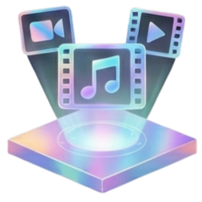

# 🎬 Studio0808 AI 影音工具站

**Unprofessional Audio & Video Processing Suite**

一個人開發的【非】專業級 AI 影音工作站 — 免費、離線、開箱即用

---

## 📸 軟體截圖

  

---

## ✨ 功能總覽

### 🎯 九大核心功能

| 功能 | 說明 | 核心技術 |
|------|------|---------|
| 🎬 **影音下載** | 一鍵下載 1000+ 平台影片，支援 4K 無損 | yt-dlp + FFmpeg |
| 🎤 **人聲與伴奏分離** | AI 拆解人聲、鼓組、貝斯、伴奏 | Meta Demucs + MDX-Net |
| 🎵 **KTV 錄音合成** | 載入伴奏即時演唱，自動混音 | WASAPI + AI 降噪 |
| 📝 **AI 生成字幕** | 自動聽打 + 翻譯 + 雙語字幕 + 壓制 | OpenAI Whisper + Pyannote |
| 🗣️ **微軟語音合成** | 免費 AI 神經網路語音，多語言多角色 | Microsoft Edge-TTS |
| 🧬 **聲音複製** | 3~10 秒人聲即可模仿音色與語氣 | GPT-SoVITS |
| 🔄 **RVC 變聲推論** | AI 翻唱，保留情緒替換音色 | RVC |
| 🎙️ **RVC 即時變聲** | 麥克風即時變聲，支援 VB-Cable 路由 | RVC Real-time |
| 🏋️ **RVC 模型訓練** | 透過 Google Colab 免費訓練專屬模型 | Applio RVC |

### 🛠️ 七大影音小工具

| 工具 | 說明 |
|------|------|
| 🎙️ 錄音助手 | 輕量錄音 + 即時音波顯示 + AI 降噪 |
| 🔄 萬用格式轉換 | 影片/音訊格式互轉，智慧無損秒轉 |
| 🎵 高音質音訊提取 | 從影片中抽離立體聲音軌 |
| ✂️ 無損簡易剪輯 | 不重新編碼的快速切割，畫質零損失 |
| 🔗 無損影音合併 | 影片 + 音訊一鍵合成，支援混音模式 |
| 📦 智能影片壓縮 | FFmpeg CRF 編碼，肉眼無差異壓縮 |
| 🤫 自動裁剪靜音 | AI 偵測無聲片段，一鍵裁除停頓 |

---

## 💻 系統需求

| 項目 | 建議規格 |
|------|---------|
| 作業系統 | Windows 10/11 (64-bit) |
| 顯示卡 | **NVIDIA RTX 系列**（強烈建議） |
| 記憶體 | 8GB 以上 |
| 硬碟空間 | 完整版約 38GB / 中量版約 25GB |

> ⚠️ 目前僅支援 Windows 系統。沒有 NVIDIA 顯卡仍可使用（自動切換 CPU 模式），但速度較慢。

---

## 📦 版本差異

| 項目 | 完整版 (~38GB) | 中量版 (~25GB) |
|------|---------------|---------------|
| 聲音複製 (GPT-SoVITS) | ✅ | ❌ |
| 其他所有功能 | ✅ | ✅ |
| 升級方式 | 替換 Studio0808.exe 即可 | 替換 Studio0808.exe 即可 |

---

## 📥 下載

- **完整版** (含聲音複製)：[Google Drive 下載](https://drive.google.com/file/d/15ZfQhFUGVTCoKxLwNDMinNuGALd3HiYC/view?usp=sharing)
- **完整版備援連結**：[Google Drive 備援](https://drive.google.com/file/d/11MaSf_Gz0MjQ0X8js2NCxmmgkgb9JyOW/view?usp=sharing)
- **中量版** (無聲音複製)：[Google Drive 下載](https://drive.google.com/file/d/1WQ4ha5JsA9Tjs8Z6oN7BpP26cZFimnOv/view?usp=sharing)

下載後解壓縮，執行 `Studio0808.exe` 即可使用，**免安裝**。

---

## 📖 線上文件

完整功能說明與操作教學：[https://begin0808.github.io/studio0808_video/](https://begin0808.github.io/studio0808_video/)

提供中文與英文雙語版本。

---

## ⚙️ 核心技術

| 技術 | 用途 |
|------|------|
| PyTorch v2.6.0+cu124 | 核心 AI 運算引擎（支援 RTX 50 系列） |
| FFmpeg | 影音編碼 / 解碼 / 合併 / 切割 |
| Demucs (htdemucs) | Meta 人聲分離模型 |
| faster-whisper | AI 語音轉寫與字幕生成 |
| Pyannote | 說話者辨識 |
| GPT-SoVITS | 語音複製合成 |
| RVC | 語音轉換（變聲） |
| Edge-TTS | 微軟雲端語音合成 |
| yt-dlp | 影音串流下載 |
| Torchcrepe | 精準音高分析 |
| CustomTkinter | 現代化 GUI 框架 |

---

## 💬 社群與交流

- **Discord**：[加入討論區](https://discord.gg/F7mC37MBtF)
- 使用問題、Bug 回報、功能許願，都歡迎到 Discord 交流！

---

## ☕ 贊助支持

Studio0808 是一套**完全免費**的軟體，沒有試用期、沒有功能限制、沒有廣告。

如果你覺得好用，歡迎自由贊助，請開發者喝杯咖啡：

- **LINE ID**：`begin0808`（李佳恩）
- 支援 LINE Pay 與 TWQR 轉帳

---

## ⚠️ 免責聲明

- 本軟體僅供個人學習、研究與學術交流使用。
- 嚴禁用於商業侵權、偽造聲音進行詐騙或散佈假消息。
- 使用者須為自身行為負完全法律責任。

---

## 📄 License

本專案的文件網頁（docs）以 GitHub Pages 方式託管。
軟體本體為獨立發布的免費桌面應用程式。

---

  <strong>© 2026 Studio0808 Team. All rights reserved.</strong> 
  Made with ❤️ in Taiwan

